# Ice Cream Store - Database Entity Relationship Diagram

**Ticket ID:** 1  
**Project:** Ice cream store management system  
**Focus:** Complete database schema relationships visualization

---

## 📊 Database Overview

This diagram represents the complete relational structure of the ice cream store management system database, showing all **21 tables** and their interconnections.

### Table Categories:

- **🔐 Authentication & Authorization** (3 tables): Users, roles, and permissions
- **👥 Customer Management** (1 table): Customer information and contact details  
- **📦 Inventory Management** (7 tables): Suppliers, ingredients, stock, recipe categories, recipes, and waste tracking
- **💰 Expenses Management** (3 tables): Expense categories, invoice, and invoice details
- **🛒 Orders Management** (2 tables): Customer transactions and order line items
- **🎁 Promotions & Loyalty** (2 tables): Promotional campaigns and customer points
- **🔧 Equipment Management** (2 tables): Equipment tracking and mechanic contacts
- **⚙️ Administration** (2 tables): System configuration and employee salary management
- **📋 Audit & Security** (1 table): Comprehensive operation auditing

---

## Entity Relationship Diagram

```mermaid
erDiagram
    %% Authentication & Authorization
    ROLES {
        uuid id PK
        varchar role_name UK
        text description
        boolean is_active
        timestamp created_at
        timestamp updated_at
    }
    
    USERS {
        uuid id PK
        varchar username UK
        varchar password_hash
        varchar full_name
        uuid role_id FK
        boolean is_active
        timestamp last_login
        timestamp created_at
        timestamp updated_at
    }
    
    PERMISSIONS {
        uuid id PK
        uuid role_id FK
        varchar permission_name
        text description
        varchar entity_name
        varchar action_name
        boolean is_active
        timestamp created_at
        timestamp updated_at
    }
    
    %% Customer Management
    CUSTOMERS {
        uuid id PK
        varchar name
        varchar phone
        varchar email
        timestamp created_at
        timestamp updated_at
    }
    
    %% Inventory Management
    SUPPLIERS {
        uuid id PK
        varchar supplier_name UK
        varchar contact_number
        varchar email
        text address
        text notes
        timestamp created_at
        timestamp updated_at
    }
    
    INGREDIENTS {
        uuid id PK
        varchar name UK
        uuid supplier_id FK
        timestamp created_at
        timestamp updated_at
    }
    
    EXISTENCES {
        uuid id PK
        integer existence_reference_code UK
        uuid ingredient_id FK
        uuid invoice_detail_id FK
        decimal units_purchased
        decimal units_available
        varchar unit_type
        integer items_per_unit
        decimal cost_per_item
        decimal cost_per_unit
        decimal total_purchase_cost
        decimal remaining_value
        date expiration_date
        decimal income_margin_percentage
        decimal income_margin_amount
        decimal iva_percentage
        decimal iva_amount
        decimal service_tax_percentage
        decimal service_tax_amount
        decimal calculated_price
        decimal final_price
        timestamp created_at
        timestamp updated_at
    }
    
    RUNOUT_INGREDIENT_REPORT {
        uuid id PK
        uuid existence_id FK
        uuid employee_id FK
        decimal quantity
        varchar unit_type
        date report_date
        timestamp created_at
        timestamp updated_at
    }
    
    RECIPE_CATEGORIES {
        uuid id PK
        varchar name UK
        text description
        timestamp created_at
        timestamp updated_at
    }
    
    RECIPES {
        uuid id PK
        varchar recipe_name UK
        text recipe_description
        varchar picture_url
        uuid recipe_category_id FK
        decimal total_recipe_cost
        timestamp created_at
        timestamp updated_at
    }
    
    RECIPE_INGREDIENTS {
        uuid id PK
        uuid recipe_id FK
        uuid ingredient_id FK
        decimal number_of_units
        timestamp created_at
        timestamp updated_at
    }
    
    %% Expenses Management
    EXPENSE_CATEGORIES {
        uuid id PK
        varchar category_name UK
        text description
        boolean is_active
        timestamp created_at
        timestamp updated_at
    }
    
    INVOICE {
        uuid id PK
        varchar invoice_number UK
        date transaction_date
        varchar transaction_type
        uuid supplier_id FK
        uuid expense_category_id FK
        decimal total_amount
        varchar image_url
        text notes
        timestamp created_at
        timestamp updated_at
    }
    
    INVOICE_DETAILS {
        uuid id PK
        uuid invoice_id FK
        uuid ingredient_id FK
        text detail
        decimal count
        varchar unit_type
        decimal price
        decimal total
        date expiration_date
        timestamp created_at
        timestamp updated_at
    }
    
    %% Orders Management
    ORDERS {
        uuid id PK
        varchar order_number UK
        uuid customer_id FK
        uuid sales_representative_id FK
        varchar status
        varchar payment_method
        varchar transaction_reference
        varchar sinpe_screenshot_url
        decimal subtotal_amount
        decimal discount_amount
        decimal iva_amount
        decimal service_tax_amount
        decimal total_amount
        varchar invoice_number UK
        varchar invoice_url
        timestamp transaction_timestamp
        timestamp completed_at
        timestamp created_at
        timestamp updated_at
    }
    
    ORDERED_RECEIPES {
        uuid id PK
        uuid order_id FK
        uuid recipe_id FK
        varchar product_name
        integer quantity
        decimal receipe_price
        decimal subtotal
    }
    
    %% Promotions & Loyalty
    PROMOTIONS {
        uuid id PK
        varchar name
        text description
        uuid recipe_id FK
        timestamp time_from
        timestamp time_to
        varchar promotion_type
        decimal value
        decimal minimum_purchase_amount
        varchar points_expiration_duration
        boolean is_active
        timestamp created_at
        timestamp updated_at
    }
    
    CUSTOMER_POINTS {
        uuid id PK
        uuid customer_id FK
        integer points_earned
        varchar points_source
        uuid order_id FK
        date date_earned
        date expiration_date
        timestamp created_at
        timestamp updated_at
    }
    
    %% Equipment Management
    MECHANICS {
        uuid id PK
        varchar name
        varchar email
        varchar phone
        text specialization
        text notes
        timestamp created_at
        timestamp updated_at
    }
    
    EQUIPMENT {
        uuid id PK
        varchar name
        text description
        date purchase_date
        uuid mechanic_id FK
        integer maintenance_schedule
        decimal purchase_cost
        varchar current_status
        date last_maintenance_date
        date next_maintenance_date
        timestamp created_at
        timestamp updated_at
    }
    
    %% Waste & Loss Tracking
    WASTE_LOSS {
        uuid id PK
        uuid existence_id FK
        varchar waste_type
        decimal items_wasted
        varchar unit_type
        decimal financial_loss
        date waste_date
        uuid reported_by FK
        text reason
        text prevention_notes
        timestamp created_at
        timestamp updated_at
    }
    
    %% Administration
    SYSTEM_CONFIG {
        uuid id PK
        varchar config_key UK
        text config_value
        varchar config_type
        text description
        boolean is_editable
        timestamp created_at
        timestamp updated_at
    }
    
    USER_SALARY {
        uuid id PK
        uuid user_id FK
        uuid invoice_id FK
        decimal salary
        decimal additional_expenses
        decimal total
        timestamp created_at
        timestamp updated_at
    }
    
    %% Audit & Security
    AUDIT_LOGS {
        uuid id PK
        uuid user_id FK
        varchar action_type
        varchar entity_type
        uuid entity_id
        jsonb old_values
        jsonb new_values
        inet ip_address
        text user_agent
        timestamp timestamp
        boolean success
        text error_message
        timestamp created_at
    }

    %% Relationships
    ROLES ||--o{ USERS : "role_id"
    ROLES ||--o{ PERMISSIONS : "role_id"
    
    CUSTOMERS ||--o{ ORDERS : "customer_id"
    CUSTOMERS ||--o{ CUSTOMER_POINTS : "customer_id"
    
    SUPPLIERS ||--o{ INGREDIENTS : "supplier_id"
    SUPPLIERS ||--o{ INVOICE : "supplier_id"
    
    INGREDIENTS ||--o{ EXISTENCES : "ingredient_id"
    INGREDIENTS ||--o{ RECIPE_INGREDIENTS : "ingredient_id"
    INGREDIENTS ||--o{ INVOICE_DETAILS : "ingredient_id"
    
    EXISTENCES ||--o{ RUNOUT_INGREDIENT_REPORT : "existence_id"
    EXISTENCES ||--o{ WASTE_LOSS : "existence_id"
    
    INVOICE ||--o{ INVOICE_DETAILS : "invoice_id"
    %% INVOICE_DETAILS ||--o{ EXISTENCES : "invoice_detail_id" -- Will be implemented when invoice service is ready
    
    RECIPE_CATEGORIES ||--o{ RECIPES : "recipe_category_id"
    
    RECIPES ||--o{ RECIPE_INGREDIENTS : "recipe_id"
    RECIPES ||--o{ ORDERED_RECEIPES : "recipe_id"
    RECIPES ||--o{ PROMOTIONS : "recipe_id"
    
    EXPENSE_CATEGORIES ||--o{ INVOICE : "expense_category_id"
    INVOICE ||--o{ USER_SALARY : "invoice_id"
    
    USERS ||--o{ ORDERS : "sales_representative_id"
    USERS ||--o{ RUNOUT_INGREDIENT_REPORT : "employee_id"
    USERS ||--o{ WASTE_LOSS : "reported_by"
    USERS ||--o{ USER_SALARY : "user_id"
    USERS ||--o{ AUDIT_LOGS : "user_id"
    
    ORDERS ||--o{ ORDERED_RECEIPES : "order_id"
    ORDERS ||--o{ CUSTOMER_POINTS : "order_id"
    
    MECHANICS ||--o{ EQUIPMENT : "mechanic_id"
```



---

## 🔗 Key Relationship Highlights

### **Central User Hub**
Users serve as the central entity connecting to:
- Order processing (sales representatives)
- Inventory reporting (runout reports)
- Waste tracking (waste reporters)
- Salary management
- Complete audit trail

### **Customer Journey**
```
Customers → Orders → Order Items (Recipes)
    ↓
Customer Points (Loyalty Program)
```

### **Complete Inventory Traceability**
```
Suppliers → Invoice → Invoice Details → Existences → Recipe Usage
                                         ↓
                                  Waste/Loss Reports
```

### **Recipe & Product System**
- Complex many-to-many relationship between recipes and ingredients
- Historical pricing snapshots in orders
- Promotion integration with recipe-specific discounts

### **Financial Integration**
- Invoice links directly to expense categories for cost tracking
- Invoice details provide detailed expense breakdown
- Salary management through invoice system
- Complete financial audit trail

### **Promotion & Loyalty Logic**
- Conditional promotions with time-based and purchase-amount validation
- Customer points system with expiration tracking
- Order integration for automatic point accumulation

---

## 📋 Business Logic Summary

1. **Inventory Flow**: Suppliers → Invoice → Invoice Details → Existences → Usage/Waste
2. **Order Processing**: Customers → Orders → Order Items + Points
3. **Financial Tracking**: All monetary transactions tracked through invoice/orders
4. **User Management**: Role-based permissions with granular access control
5. **Audit Trail**: Complete operation logging for compliance and security
6. **Equipment Lifecycle**: Purchase → Maintenance → Status tracking
7. **Promotion Engine**: Time-based, recipe-specific, and customer-targeted campaigns

---

**Diagram Generated:** `r new Date().toISOString()`  
**Total Tables:** 21  
**Total Relationships:** 25+ foreign key constraints 